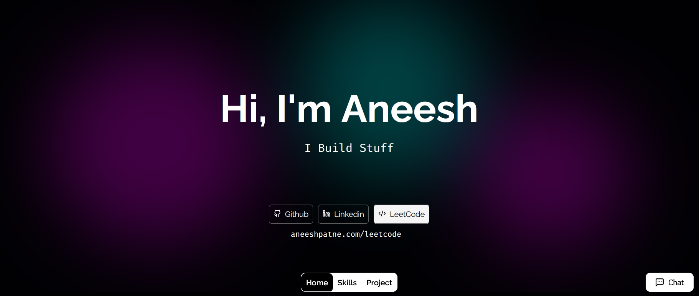

# 🚀 Aneesh Patne - Personal Portfolio

<div align="center">

[](https://aneeshpatne.com)
[](https://nextjs.org/)
[](https://reactjs.org/)
[](https://www.typescriptlang.org/)
[](https://vercel.com/)

<a href="https://aneeshpatne.com">

</a>

_A modern, interactive portfolio showcasing full-stack development expertise and AI innovation_

</div>

---

## 🌟 Overview

Welcome to my cutting-edge personal portfolio! This isn't just another developer website – it's a comprehensive digital experience that showcases my journey as a **Full-Stack Developer**, **AI Enthusiast**, and **Problem Solver**.

Built with the latest web technologies and powered by AI, this portfolio represents the perfect blend of technical excellence and creative design.

🔗 **[Visit Live Portfolio](https://aneeshpatne.com)**

---

## ✨ Key Features

### 🎨 **Modern UI/UX Design**

- **Responsive Design** - Seamlessly adapts to all screen sizes
- **Dark/Light Mode** - Toggle between themes with smooth transitions
- **Micro-interactions** - Delightful animations powered by Framer Motion
- **Gradient Animations** - Dynamic background effects and visual elements

### 🤖 **AI-Powered Features**

- **Interactive Chat** - AI assistant for project discussions and resume queries
- **Smart Project Filtering** - AI-enhanced project categorization
- **Dynamic Content** - LLM-powered project descriptions and insights

### 📊 **Skills Visualization**

- **Interactive Skill Charts** - Visual representation using Recharts
- **Technology Proficiency** - Detailed breakdown of technical expertise
- **Certification Showcase** - Google ML Engineer & other achievements
- **Project Statistics** - 600+ LeetCode problems solved and more

### 🗃️ **Database Integration**

- **Prisma ORM** - Type-safe database operations
- **Project Management** - Dynamic project data with rich metadata
- **Performance Optimization** - Efficient data fetching and caching

### 🔧 **Advanced Development Features**

- **TypeScript Ready** - Full type safety and developer experience
- **API Routes** - Custom backend functionality with Next.js
- **Component Architecture** - Modular, reusable components
- **SEO Optimized** - Meta tags, structured data, and performance

---

## 🛠️ Tech Stack

### **Frontend**


### **Backend & Database**


### **AI & APIs**


### **Tools & Libraries**


### **Deployment & Hosting**


---

## 🚀 Quick Start

### Prerequisites

- Node.js 18+
- npm or yarn
- Git

---

## 📁 Project Structure

```
Personal-Portfolio/
├── 📂 public/
│   └── 📂 assets/
│       └── 📂 img/           # Project images and assets
├── 📂 src/
│   ├── 📂 app/
│   │   ├── 📂 api/           # API routes
│   │   │   ├── 📂 chat/      # AI chat functionality
│   │   │   └── 📂 resume/    # Resume-related APIs
│   │   ├── 📂 project/       # Dynamic project pages
│   │   └── 📄 layout.js      # Root layout
│   ├── 📂 components/
│   │   ├── 📄 HomePage.jsx   # Main homepage component
│   │   ├── 📄 Menu.jsx       # Navigation component
│   │   ├── 📄 ProjectNew.jsx # Project showcase
│   │   ├── 📄 chat.jsx       # AI chat interface
│   │   └── 📂 style/         # Component-specific CSS modules
│   ├── 📂 generated/
│   │   └── 📂 prisma/        # Generated Prisma types
│   └── 📂 lib/
│       ├── 📄 db.js          # Database configuration
│       └── 📄 schema.js      # Database schema
├── 📄 package.json
├── 📄 next.config.mjs
└── 📄 README.md
```

---

## 🎨 Features Showcase

### **Interactive Components**

- **Hero Section** with animated particles and typewriter effect
- **Skills Matrix** with interactive hover states and proficiency levels
- **Project Cards** with smooth transitions and detailed views
- **AI Chat Interface** with real-time responses and error handling

### **Performance Optimizations**

- **Image Optimization** with Next.js Image component
- **Code Splitting** with dynamic imports
- **SEO Optimization** with meta tags and structured data
- **Responsive Design** with mobile-first approach

### **Design System**

- **CSS Variables** for consistent theming
- **Component Modularity** with CSS Modules
- **Animation Library** integration with Framer Motion
- **Icon System** using Lucide and React Icons

---

## 📞 Contact & Connect

<div align="center">

[](https://aneeshpatne.com)
[](https://linkedin.com/in/aneeshpatne)
[](https://github.com/aneeshpatne)
[](https://leetcode.com/u/aneeshpatne)

**✨ Let's build something amazing together! ✨**

</div>

---

<div align="center">
<sub>Built with ❤️ by <a href="https://aneeshpatne.com">Aneesh Patne</a></sub>
</div>
